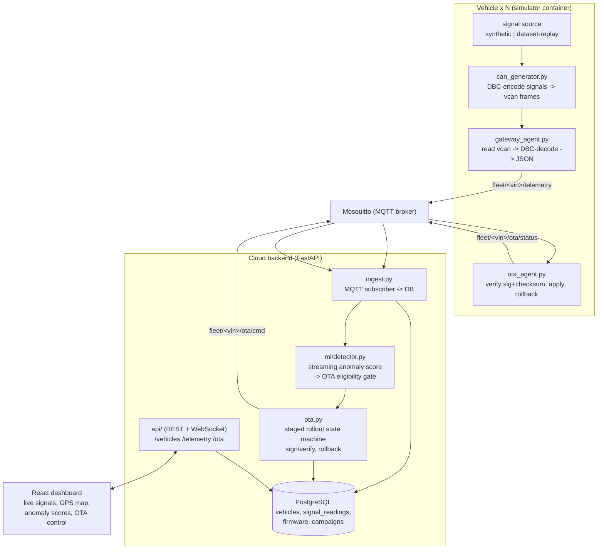
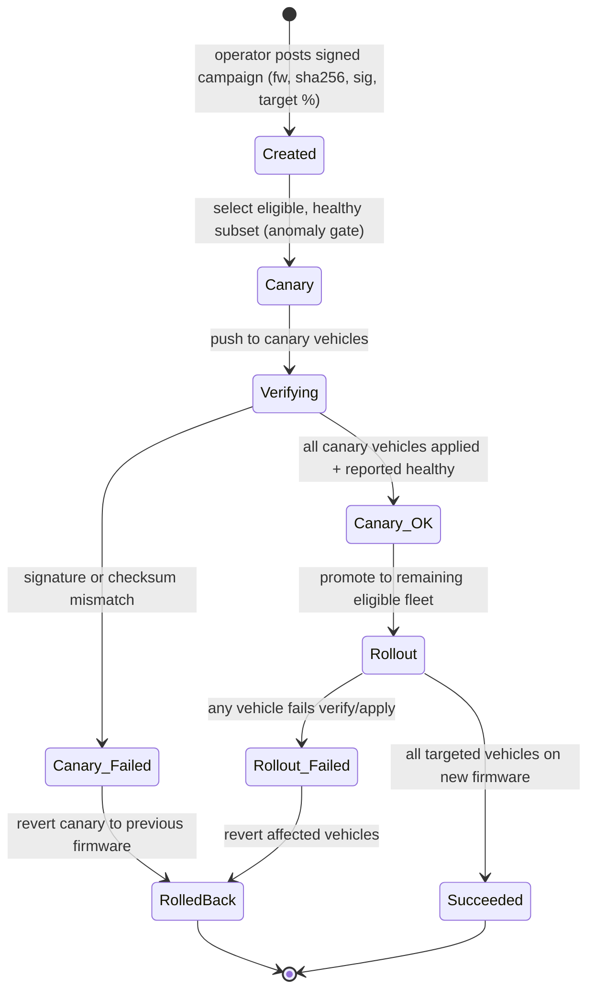

# Parallax Mini

A software-only simulation of a connected vehicle fleet that emits real CAN-bus telemetry, streams it to a cloud backend for fleet-wide observability, and ships **signed, staged, auto-rolling-back OTA firmware updates** — gated by a streaming anomaly-detection model. Runs entirely on one machine with `docker compose up`.

## Problem

Modern vehicles are **software-defined**: their behavior comes from firmware on embedded controllers (ECUs) that communicate over a **CAN bus**. Any team operating a connected fleet faces three hard problems that are expensive and slow to iterate on with real hardware:

1. **Fleet-wide observability.** Each vehicle emits high-frequency CAN signals (speed, state-of-charge, temperature, GPS). Decoding these against a signal database and centralizing them so an operator can watch the whole fleet live is non-trivial — you cannot plug a laptop into thousands of cars.
2. **Safe remote updates (OTA).** Pushing firmware to a fleet is dangerous. A bad update can brick vehicles. Production programs mitigate this with **staged/canary rollout** (ship to a small subset first), **integrity verification** (signature + checksum before applying), and **automatic rollback** on failure.
3. **Health-aware release gating.** You should not push an update to a vehicle that is already showing anomalous behavior. Deciding eligibility requires detecting anomalies from streaming telemetry in real time.

**The engineering obstacle:** you cannot iterate on any of this with physical vehicles — hardware access is slow, costly, and hard to coordinate.

## The Idea

Parallax Mini reproduces the real interfaces, not toy abstractions:

- Vehicles generate **actual CAN frames on Linux SocketCAN virtual (`vcan`) interfaces** — the same interface real embedded Linux systems use.
- Frames are decoded against a **DBC** signal database (via `cantools`) and published over **MQTT**, exactly like a real telematics gateway.
- A cloud backend ingests telemetry into **PostgreSQL**, exposes a **REST/WebSocket API**, and runs an **OTA campaign engine** with **Ed25519 signature + SHA-256 checksum verification, staged rollout, and rollback**.
- A **streaming anomaly detector** scores each vehicle's telemetry and **gates OTA eligibility** — unhealthy vehicles are held back from a campaign.
- A **React dashboard** shows live per-vehicle signals, a GPS fleet map, anomaly scores, and OTA rollout progress.

The signal source is **pluggable**: a procedural synthetic generator by default (self-contained, runs anywhere), or a **dataset-replay** mode that encodes real driving traces (e.g., the Vehicle Energy Dataset) into CAN frames for realistic dynamics.

## Architecture



### OTA campaign state machine



**How the OTA flow works (briefly):** An operator submits a firmware artifact with a version, its SHA-256 checksum, and an **Ed25519 signature**, plus a target percentage. The engine selects only vehicles the anomaly detector marks **healthy**, pushes to a small **canary** subset first, and each vehicle **verifies the signature and checksum before applying**. If any canary vehicle fails verification or reports unhealthy after applying, the campaign **rolls the affected vehicles back** to their previous firmware and halts. Only a clean canary is promoted to the rest of the eligible fleet.

## Inputs and Outputs

| | Input | Output |
|---|---|---|
| **Simulator** | DBC + signal source (synthetic profile or replayed trip) | Raw CAN frames on `vcan` |
| **Gateway** | Raw CAN frames + DBC | Decoded JSON telemetry on MQTT `fleet/<vin>/telemetry` |
| **Backend ingest** | MQTT telemetry | Rows in `signal_readings`; anomaly scores |
| **OTA API** | Signed campaign `{version, sha256, signature, target_%}` | Campaign object with per-vehicle status (`applied` / `rolled_back`) |
| **Dashboard** | REST/WebSocket data | Live signals, GPS map, anomaly scores, rollout progress |

## Prerequisites

- Docker and Docker Compose
- Python 3.11+ (for running tests / tooling locally)
- Node 20+ (for the dashboard dev server)
- Linux host recommended for native `vcan`. On macOS/Windows the simulator falls back to an in-process virtual bus with identical DBC decode logic (see PLAN.md).

## Building

```bash
# Backend and simulator images + broker + db
docker compose build

# Dashboard (dev)
cd dashboard && npm install
```

## Running

```bash
# Start broker, database, backend, and a fleet of ~20 simulated vehicles
docker compose up

# Dashboard dev server (separate terminal)
cd dashboard && npm run dev
```

## Launching an OTA campaign

```bash
# Sign and register a firmware artifact, then roll it out to 20% of the fleet first
./scripts/ota_campaign.sh firmware/app-1.5.0.bin 1.5.0 20
```

The engine stages to a healthy canary subset, verifies signature + checksum on each vehicle, and rolls back automatically on failure. Watch progress live on the dashboard.

## Tests

```bash
# Unit tests: DBC encode/decode round-trip, ingest, OTA rollback, anomaly gate
pytest

# OTA rollback proof (forces a checksum mismatch and asserts rollback)
pytest tests/test_ota_rollback.py -v
```

## Configuration

| Env Var | Default | Description |
|---|---|---|
| `FLEET_SIZE` | `20` | Number of simulated vehicles |
| `SIGNAL_SOURCE` | `synthetic` | `synthetic` or `replay` (dataset-driven) |
| `SAMPLE_HZ` | `1` | Telemetry samples per vehicle per second |
| `MQTT_HOST` | `mosquitto` | MQTT broker host |
| `DATABASE_URL` | `postgresql://parallax:parallax@db:5432/parallax` | Postgres connection string |
| `OTA_CANARY_PCT` | `20` | Canary subset percentage for staged rollout |
| `ANOMALY_THRESHOLD` | `0.8` | Score above which a vehicle is held back from OTA |
| `OTA_PUBLIC_KEY` | `keys/ota_pub.pem` | Ed25519 public key used by vehicles to verify firmware |

See [PLAN.md](./PLAN.md) for the full design, I/O contracts, phased build plan, and scope decisions.
